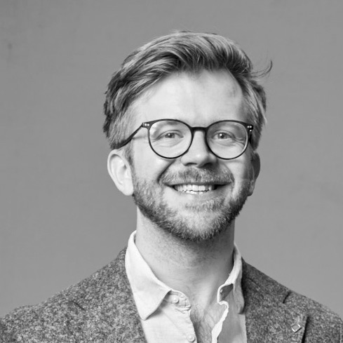

 <!-- 20px of vertical space -->

<table style="width:100%">
    <tr>
        </td>
            <td align="left" style="padding:2.5%;width:40%">
            
        </td>
        <td>
            <strong>Wolf</strong>ram <strong>Barfuss</strong>  
            <a href="https://barfusslab.github.io">Argelander-Professor of Integrated Systems Modeling for Sustainability Transitions</a> 
            University of Bonn, Germany 
            <small>
            <!-- <a href="https://wbarfuss.github.io"><i class="bi bi-link-45deg"></i></a>  -->
            <a href="mailto:wbarfuss@uni-bonn.de"><i class="bi bi-envelope-fill"></i></a> 
            <a href="https://scholar.google.com/citations?hl=en&user=ZAqFy78AAAAJ"><i class="bi bi-book-fill"></i></a>
            <i class="fa-brands fa-google-scholar"></i> 
            <a href="https://github.com/wbarfuss"><i class="bi bi-github"></i></a> 
            <a href="https://www.linkedin.com/in/wolfram-barfuss/"><i class="bi bi-linkedin"></i></a> 
            <a href="https://twitter.com/WolframBarfuss"><i class="bi bi-twitter"></i></a> 
            </small>
    </tr>
</table>
    

 <!-- 20px of vertical space -->

<!-- [Institute for Food and Resource Economics](https://www.ilr1.uni-bonn.de/en), Uni Bonn -->

Argelander (Tenure-Track) Assistant Professor of the [Transdisciplinary Research Area (TRA) Sustainable Futures](https://www.uni-bonn.de/en/research-and-teaching/research-profile/transdisciplinary-research-areas/tra-6-sustainable-futures/tra-sustainable-futures?set_language=en) at 
the [Center for Development Research (ZEF)](https://www.zef.de/about-zef/divisions-groups/model/outline.html), University of Bonn

Member of the 
* [AEI Faculty](https://www.aei.uni-bonn.de/en/home), University of Bonn
* TRAs [Modeling](https://www.uni-bonn.de/en/research-and-teaching/research-profile/transdisciplinary-research-areas/tra-1-modelling/home/) and [Individual and Societies](), University of Bonn
* [Cluster of Excellence PhenoRob](https://www.phenorob.de), University of Bonn
* [Center for Earth System Observation and Computational Analysis (CESOC)](https://cesoc.net), Bonn-Cologne-Juelich
* [Earth Resilience Science Unit](https://www.pik-potsdam.de/en/institute/futurelabs/earthresilience), Potsdam Institute for Climate Impact Research
* [Earth Resilience and Sustainability Initiative](http://earthresiliencesustainability.org/), Princeton-Stockholm-Potsdam

> My research centers around the question, *Are we smart enough for the good life*? To answer it, my team and I develop formal models of collective learning to better understand how in complex environments, individual decisions become collective action for a sustainable future.  [Read more](https://barfusslab.github.io/mission.html) 
<blockquote>
</blockquote>

 <!-- 20px of vertical space -->

<!-- 

 20px of vertical space -->

